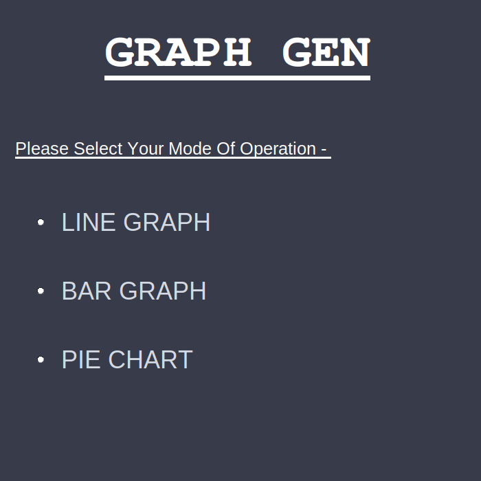
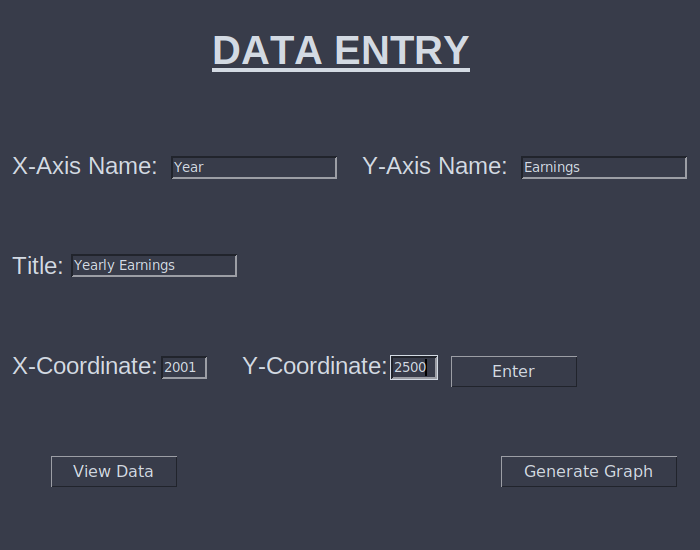
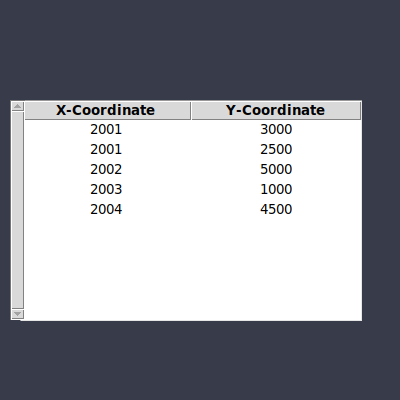
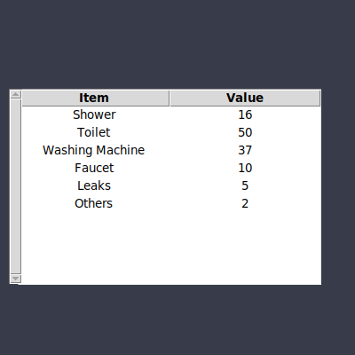
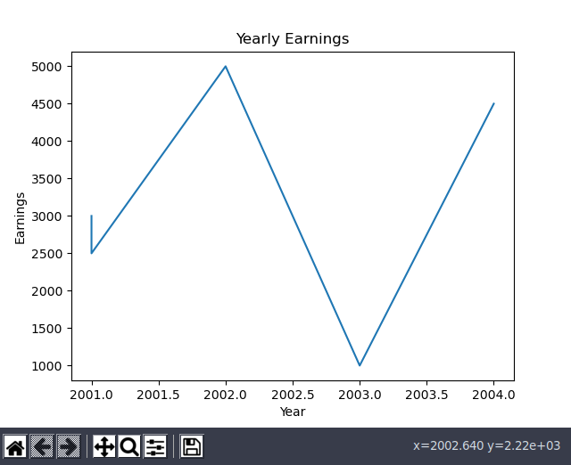
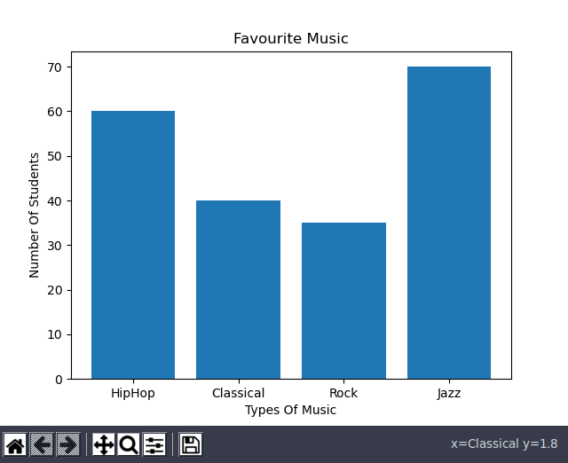
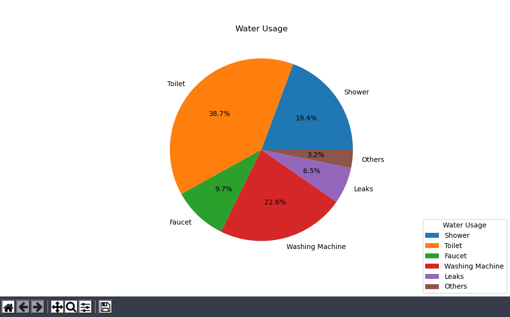

# Graphy

Graphy visualizes data using Tkinter and Matplotlib


## Prerequisites

Use the package manager [pip](https://pip.pypa.io/en/stable/) to install matplotlib.

```bash
pip install matplotlib

```


Use the package manager [pip](https://pip.pypa.io/en/stable/) to install tkinter.

```bash
pip install tk

```


## Usage

### Linux
```bash
python3 main.py
```
### Windows
```bash
python main.py
```

## Screenshots














## Contributing
Pull requests are welcome. For major changes, please open an issue first to discuss what you would like to change.
## Contact

Aditya Walia - adi.walia16@gmail.com


